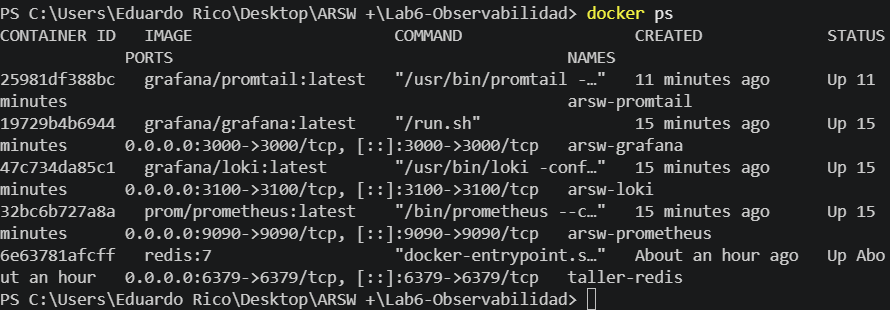
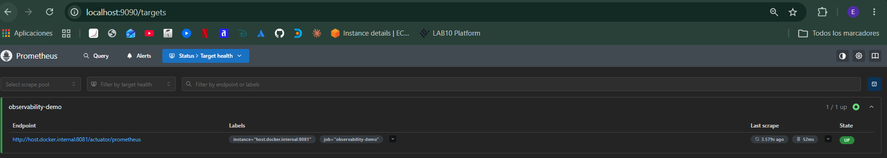
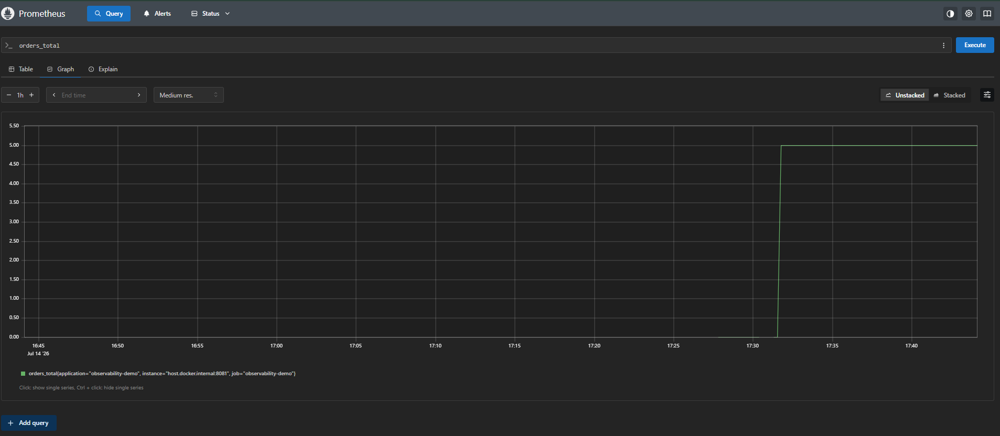
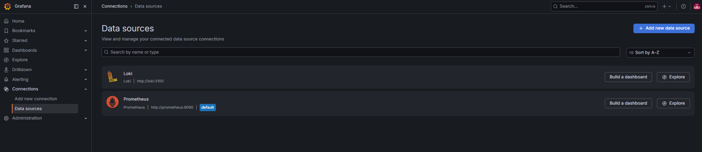
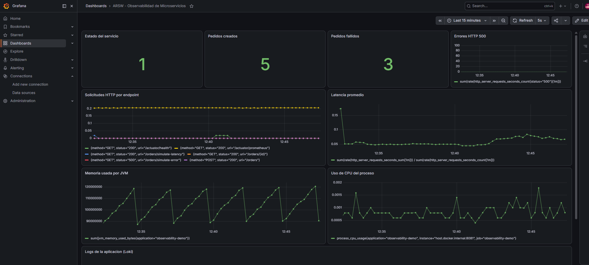

# Lab6 - Observabilidad de Microservicios

Informe del laboratorio de **Observabilidad de Microservicios con Grafana, Prometheus, Loki y OpenTelemetry** (Arquitecturas de Software). Este documento explica, en palabras simples y en orden, todo lo que se hizo para levantar el entorno, instrumentar la aplicación y analizar los incidentes simulados. Está pensado para poder sustentarlo sin necesidad de memorizar comandos: aquí está el "por qué" de cada paso.

> Autor: Eduardo Rico Duarte

---

## 1. ¿De qué trata este laboratorio?

La idea central es entender la diferencia entre **monitorear** (saber si algo está prendido o apagado, o si supera un umbral) y **observar** (poder investigar *por qué* algo está pasando, aunque no lo hayamos previsto antes).

Para lograr eso se construyó una aplicación pequeña en Spring Boot que simula un servicio de pedidos, y se le "conectaron" tres herramientas:

- **Prometheus**: cada 5 segundos le pregunta a la aplicación "¿cómo vas?" y guarda esos números (métricas) en el tiempo.
- **Loki**: guarda los logs (los mensajes de texto que la aplicación va escribiendo mientras corre).
- **Grafana**: es el tablero donde se ven las métricas y los logs juntos, en gráficas y paneles.

Todo esto corre en contenedores Docker, menos la aplicación Spring Boot, que corre directamente en la máquina (esto se explica más adelante porque tuvo un impacto real en la configuración).

---

## 2. Qué se construyó (resumen de la arquitectura)

```
Cliente (curl / Postman)
        │
        ▼
Aplicación Spring Boot (puerto 8081)
  - Endpoints /orders
  - Actuator + Micrometer (métricas)
  - Logs escritos a un archivo
        │                 │
    métricas             logs
        │                 │
        ▼                 ▼
   Prometheus          Promtail ──▶ Loki
   (puerto 9090)                  (puerto 3100)
        │                             │
        └────────────┬────────────────┘
                      ▼
                  Grafana
             (puerto 3000, dashboards)
```

### Estructura del repositorio

```
Lab6-Observabilidad
│
├── docker-compose.yml            # Levanta Prometheus, Grafana, Loki y Promtail
├── prometheus/prometheus.yml     # Le dice a Prometheus a quién "scrapear"
├── loki/loki-config.yml          # Configuración mínima de Loki
├── promtail/promtail-config.yml  # Le dice a Promtail qué logs leer y a dónde enviarlos
├── grafana/dashboard-provisioning.json  # Copia del dashboard creado en Grafana (respaldo)
└── app/observability-demo/       # Proyecto Maven de Spring Boot
    └── src/main/java/edu/eci/arsw/observability/
        ├── ObservabilityDemoApplication.java
        └── controller/
            ├── OrderController.java
            └── GlobalExceptionHandler.java
```

---

## 3. Paso a paso de lo que se hizo

### 3.1 Verificación de requisitos

Se confirmó que la máquina tenía todo lo necesario:

```bash
java --version     # OpenJDK 21
mvn --version       # Maven 3.9.12
docker --version    # Docker 29
docker compose version
```

### 3.2 Creación de la aplicación Spring Boot

Se creó el proyecto Maven `observability-demo` con las dependencias que pide la guía: `spring-boot-starter-web`, `spring-boot-starter-actuator`, `micrometer-registry-prometheus` y `spring-boot-starter-validation`.

La idea de estas dependencias es simple:
- **Actuator** abre "puertitas" (endpoints) para que herramientas externas puedan preguntar por el estado interno de la app (salud, métricas, etc.).
- **Micrometer** es el que realmente recolecta esas métricas (contadores, tiempos, memoria) y las traduce al formato que Prometheus entiende.

Se creó el controlador `OrderController` con estos endpoints:

| Endpoint | Qué hace |
|---|---|
| `POST /orders` | Crea un pedido y aumenta un contador `orders_created_total` |
| `GET /orders/{id}` | Consulta un pedido (endpoint de ejemplo) |
| `GET /orders/simulate-latency` | Duerme entre 0.5 y 3 segundos, para simular lentitud |
| `GET /orders/simulate-error` | Lanza una excepción a propósito, para simular una falla |

También se creó `GlobalExceptionHandler`, una clase que atrapa cualquier error no controlado, lo registra en el log como `ERROR` y responde al cliente con un JSON ordenado (en vez de un error feo de Spring).

### 3.3 Configuración de Actuator (`application.yml`)

Se expusieron los endpoints necesarios:

```yaml
management:
  endpoints:
    web:
      exposure:
        include: health,info,metrics,prometheus
```

El endpoint clave para este laboratorio es `http://localhost:8081/actuator/prometheus`, que devuelve todas las métricas en texto plano, listas para que Prometheus las lea.

**Ajuste que se hizo sobre la guía original:** la aplicación corre directamente en Windows (no dentro de Docker), así que sus logs no quedaban visibles para el contenedor de Promtail. Para solucionarlo se agregó esta configuración adicional, que hace que los logs también se escriban en un archivo:

```yaml
logging:
  file:
    name: logs/observability-demo.log
```

Ese archivo luego se monta como volumen dentro del contenedor de Promtail (ver sección 3.6).

### 3.4 Prueba local de la aplicación

Se ejecutó la aplicación con `mvn spring-boot:run` (o el jar empaquetado) y se probaron los endpoints con `curl`:

```bash
curl http://localhost:8081/actuator/health
curl http://localhost:8081/actuator/prometheus
curl -X POST http://localhost:8081/orders -H "Content-Type: application/json" -d '{"customerId":"CUS-01","total":120000}'
curl http://localhost:8081/orders/simulate-latency
curl http://localhost:8081/orders/simulate-error
```

Todo respondió como se esperaba: `/actuator/health` devolvió `{"status":"UP"}`, y `/actuator/prometheus` mostró métricas técnicas (`jvm_memory_used_bytes`, `process_cpu_usage`, `http_server_requests_seconds_count`) y las de negocio (`orders_failed_total`).

> **Hallazgo importante:** en la guía el contador se llama `orders_created_total`, pero al mirar la salida real del endpoint `/actuator/prometheus`, ese contador aparece como **`orders_total`** (sin la palabra "created"). Esto no es un error del código: Micrometer le quita automáticamente la palabra `created` a los contadores, porque en el estándar OpenMetrics esa palabra está reservada para otro tipo de métrica interna. Por eso, en el dashboard de Grafana y en las consultas de este informe se usa `orders_total` en vez de `orders_created_total`. Es un buen ejemplo real de por qué la observabilidad requiere *verificar* lo que la aplicación expone y no solo confiar en la documentación.

### 3.5 Configuración de Prometheus

Archivo `prometheus/prometheus.yml`: le dice a Prometheus que cada 5 segundos consulte la aplicación en `host.docker.internal:8081/actuator/prometheus` (esa dirección especial permite que un contenedor Docker hable con el proceso que corre en el sistema operativo anfitrión, es decir, con la app Spring Boot).

### 3.6 Configuración de Loki y Promtail

- `loki/loki-config.yml`: configuración básica de Loki, guardando todo en el sistema de archivos local (sin bases de datos externas, apropiado para un laboratorio).
- `promtail/promtail-config.yml`: Promtail es el "cartero" que lee archivos de log y se los entrega a Loki. Se le agregó un segundo trabajo (`observability-demo-app`) apuntando a la carpeta donde la aplicación escribe su log, con la etiqueta `job="observability-demo"`.

En `docker-compose.yml` se montó la carpeta de logs de la aplicación dentro del contenedor de Promtail:

```yaml
promtail:
  volumes:
    - ./app/observability-demo/logs:/var/log/observability-demo
```

Esto fue necesario justamente por la razón explicada en 3.3: como la app no corre en un contenedor, sin este volumen Promtail no tenía forma de leer sus logs.

### 3.7 Levantar el entorno con Docker Compose

```bash
docker compose up -d
docker ps
```

Se verificó que los 4 contenedores quedaran corriendo:

```
arsw-prometheus   Up   0.0.0.0:9090->9090/tcp
arsw-grafana      Up   0.0.0.0:3000->3000/tcp
arsw-loki         Up   0.0.0.0:3100->3100/tcp
arsw-promtail     Up
```

### 3.8 Verificación de Prometheus

En `http://localhost:9090` → **Status → Targets** se confirmó que el target `observability-demo` queda en estado **UP**. Esto significa que Prometheus efectivamente le está haciendo scraping a la aplicación.

También se probaron consultas PromQL directamente en Prometheus: `up`, `http_server_requests_seconds_count`, `jvm_memory_used_bytes`, `orders_total`, `orders_failed_total`. Todas devolvieron datos.

### 3.9 Configuración de Grafana

Se entró a `http://localhost:3000` (usuario `admin`, clave `admin`) y se configuraron las dos fuentes de datos:

- **Prometheus** → URL `http://prometheus:9090`
- **Loki** → URL `http://loki:3100`

> Nota: para ahorrar tiempo, estas dos fuentes de datos y el dashboard completo (8 paneles + panel de logs) ya quedaron **creados automáticamente** en tu Grafana mediante la API de Grafana. Es decir, cuando abras `http://localhost:3000` no vas a partir de cero: el dashboard ya existe y se llama **"ARSW - Observabilidad de Microservicios"**. Aun así, en la sección 3.10 se explica cómo se construye cada panel manualmente, por si te lo piden explicar o rehacer en la sustentación.

### 3.10 Paneles del dashboard

| # | Panel | Consulta PromQL / LogQL | Tipo | Qué permite ver |
|---|---|---|---|---|
| 1 | Estado del servicio | `up{job="observability-demo"}` | Stat | Si Prometheus puede consultar la app (1 = sí, 0 = no) |
| 2 | Solicitudes HTTP por endpoint | `sum by (uri, method, status) (rate(http_server_requests_seconds_count[1m]))` | Time series | Cuántas peticiones por segundo recibe cada endpoint |
| 3 | Latencia promedio | `sum(rate(http_server_requests_seconds_sum[1m])) / sum(rate(http_server_requests_seconds_count[1m]))` | Time series | Si el tiempo de respuesta está subiendo |
| 4 | Errores HTTP 500 | `sum(rate(http_server_requests_seconds_count{status="500"}[1m]))` | Time series | Tasa de errores internos |
| 5 | Pedidos creados | `orders_total` | Stat | Cuántos pedidos se han creado con éxito |
| 6 | Pedidos fallidos | `orders_failed_total` | Stat | Cuántos errores simulados hay en el flujo de pedidos |
| 7 | Memoria usada por JVM | `sum(jvm_memory_used_bytes{application="observability-demo"})` | Time series | Consumo de memoria de la app |
| 8 | Uso de CPU del proceso | `process_cpu_usage{application="observability-demo"}` | Time series | Carga aproximada del proceso Java |
| 9 | Logs de la aplicación | `{job="observability-demo"}` | Logs (Loki) | Ver en vivo lo que la app está registrando |

---

## 4. Simulación de incidentes y análisis

Se generaron tres incidentes controlados, tal como pide la guía, y se observó su efecto en métricas, paneles y logs.

### Incidente 1 — Aumento de errores

**Comando:**
```bash
curl http://localhost:8081/orders/simulate-error
```
(repetido varias veces)

- **Métrica afectada:** `orders_failed_total` sube, y el panel de "Errores HTTP 500" muestra actividad.
- **Log relacionado:** en Loki aparece `ERROR ... Error simulado en el servicio de pedidos` y `Excepción controlada por el manejador global`.
- **Endpoint involucrado:** `/orders/simulate-error`.
- **Posible causa:** un error de negocio o técnico intencional (en un caso real podría ser una dependencia caída, un dato inválido, etc.).
- **Impacto para el usuario:** recibe un HTTP 500 en vez de una respuesta útil.
- **Acción correctiva:** revisar el log de la excepción para identificar la causa raíz y agregar manejo específico si el error es recurrente.
- **Alerta que debería existir:** alertar cuando la tasa de errores 500 sea mayor a 0 durante más de 1 minuto.

### Incidente 2 — Aumento de latencia

**Comando:**
```bash
curl http://localhost:8081/orders/simulate-latency
```
(repetido varias veces)

- **Métrica afectada:** la latencia promedio (panel 3) sube notoriamente durante las repeticiones.
- **Endpoint más lento:** `/orders/simulate-latency` (aparece con el tiempo más alto en el panel de "solicitudes por endpoint").
- **Log relacionado:** `WARN ... Simulando latencia artificial de XXXX ms`.
- **Impacto para el usuario:** respuestas lentas, mala experiencia, posibles timeouts en cadena si hay otros servicios esperando esta respuesta.
- **Acción correctiva:** identificar si la lentitud es real (I/O, base de datos, red) o artificial como en este caso, y optimizar o escalar el recurso lento.
- **Alerta que debería existir:** alertar si la latencia promedio supera 1 segundo sostenido por más de 1 minuto.

### Incidente 3 — Creación de pedidos (actividad normal)

**Comando:**
```bash
curl -X POST http://localhost:8081/orders \
  -H "Content-Type: application/json" \
  -d '{"customerId":"CUS-01","total":120000}'
```
(repetido varias veces)

- **Métrica que evidencia actividad de negocio:** `orders_total` (contador que sube con cada pedido creado).
- **Log que permite rastrear un pedido específico:** `INFO ... Pedido creado correctamente. orderId=ORD-xxxxx` — como cada log incluye el `orderId`, se puede buscar ese pedido puntual en Loki.
- **Qué agregaría para mejorar la trazabilidad:** un identificador de correlación (*trace id*) que viaje entre servicios, para poder seguir un mismo pedido si en el futuro pasa por varios microservicios (pagos, inventario, envíos). Esto es justamente lo que resuelve OpenTelemetry con las trazas distribuidas (ver sección 6).

---

## 5. Alertas propuestas

| Alerta | Condición (PromQL) | Qué significa |
|---|---|---|
| Servicio caído | `up{job="observability-demo"} == 0` | Prometheus no puede consultar la aplicación: probablemente está apagada o inaccesible |
| Errores HTTP 500 | `sum(rate(http_server_requests_seconds_count{status="500"}[1m])) > 0` | La aplicación está generando errores internos |
| Latencia elevada | `(sum(rate(http_server_requests_seconds_sum[1m])) / sum(rate(http_server_requests_seconds_count[1m]))) > 1` | El tiempo de respuesta promedio supera 1 segundo |

Estas tres se configuran en Grafana desde **Alerting → Alert rules**, usando como fuente de datos Prometheus y la consulta correspondiente como condición.

---

## 6. Observabilidad en una arquitectura más grande (ejercicio conceptual)

La guía plantea un caso con 5 servicios: `order-service`, `payment-service`, `inventory-service`, `notification-service`, `shipping-service`. Aplicando lo aprendido en este laboratorio:

- **Señales para detectar un problema en pagos:** tasa de errores del `payment-service`, latencia de sus llamadas a la pasarela de pago externa, y logs con el resultado de cada transacción (aprobada / rechazada / error).
- **Señales para detectar lentitud en inventario:** métrica de latencia de `inventory-service`, tiempo de las consultas a su base de datos, y una traza que muestre en qué paso del flujo se demora.
- **Señales para saber si las notificaciones fallan:** contador de notificaciones fallidas vs. enviadas, y logs de error al conectarse con el proveedor de correo/SMS/push.
- **Métrica para medir disponibilidad:** `up` de cada servicio (o un *health check* agregado), y el porcentaje de peticiones exitosas (2xx) sobre el total.
- **Métrica para medir experiencia del usuario:** latencia percibida de extremo a extremo (idealmente con trazas), más la tasa de errores visibles para el usuario final.

En este escenario, las **trazas** (OpenTelemetry) son las que realmente permiten saber, de una sola solicitud de compra, en cuál de los 5 servicios se originó la lentitud o el error — algo que ni las métricas ni los logs por separado pueden mostrar con la misma claridad.

---

## 10. Evidencia

A continuación se presentan las capturas de pantalla que respaldan cada etapa del laboratorio: el levantamiento del entorno con Docker, la verificación de Prometheus, la configuración de las fuentes de datos en Grafana y el dashboard final ya recibiendo tráfico de la aplicación.

### 1. Contenedores corriendo

Salida de `docker ps` mostrando los contenedores del stack de observabilidad (`arsw-prometheus`, `arsw-grafana`, `arsw-loki`, `arsw-promtail`) en estado `Up`.



### 2. Prometheus — Targets UP

Vista de `Status → Targets` en Prometheus, confirmando que el target `observability-demo` está en estado **UP** y que el scraping a `http://host.docker.internal:8081/actuator/prometheus` se realiza correctamente.



### 3. Consulta PromQL en Prometheus

Resultado de la consulta `orders_total` ejecutada directamente en Prometheus (`/graph`), donde se observa el salto en el contador de pedidos creados a medida que se generó tráfico contra el endpoint `POST /orders`.



### 4. Fuentes de datos configuradas en Grafana

Pantalla de `Connections → Data sources` en Grafana, con las dos fuentes ya configuradas y funcionando: **Prometheus** (`http://prometheus:9090`, marcada como `default`) y **Loki** (`http://loki:3100`).



### 5. Dashboard general "ARSW - Observabilidad de Microservicios"

Vista general del dashboard con los paneles de Estado del servicio, Pedidos creados, Pedidos fallidos, Errores HTTP 500, Solicitudes HTTP por endpoint, Latencia promedio, Memoria usada por JVM y Uso de CPU del proceso, todos recibiendo datos en tiempo real.



---

## 11. Cierre

Este laboratorio permitió construir, de punta a punta, una solución de observabilidad para un microservicio en Spring Boot: se instrumentó con Actuator y Micrometer, se recolectaron las métricas con Prometheus, se centralizaron los logs con Loki, y se armó un dashboard en Grafana para verlo todo junto. Más allá de las herramientas, la parte más importante fue poder responder preguntas concretas frente a un incidente simulado: *qué* pasó, *dónde* pasó, y *qué métrica o log lo confirma*. Esa es, al final, la diferencia real entre tener un sistema encendido y tener un sistema que se puede entender cuando algo sale mal.
